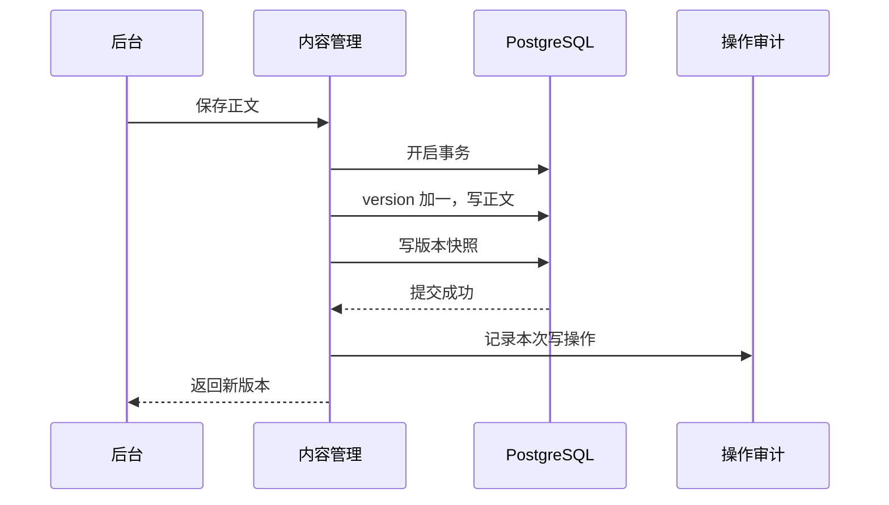
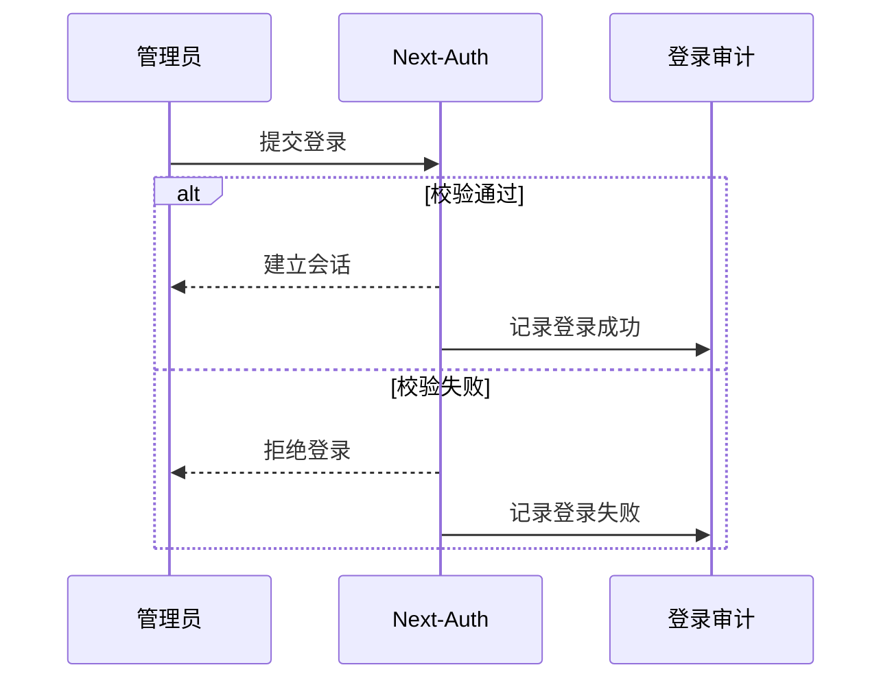
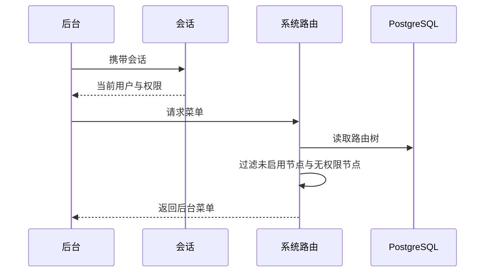
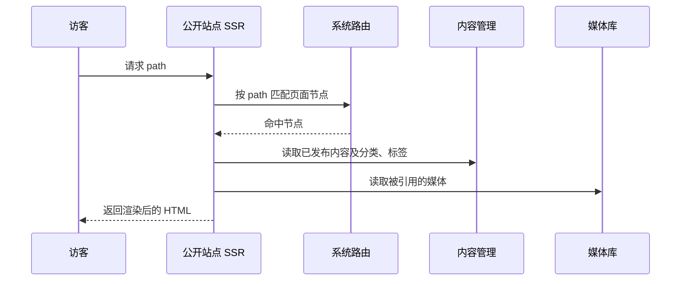
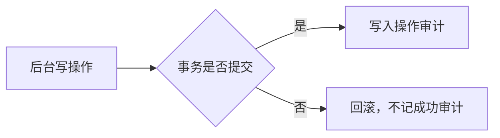
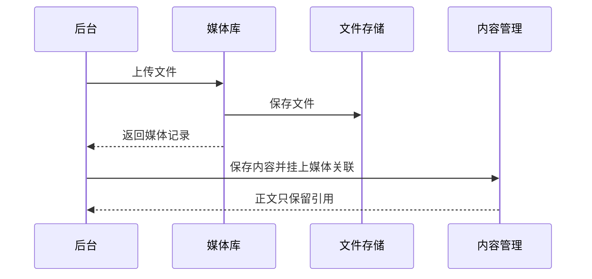

# 核心数据流

本文描述个人内容管理系统的关键数据流。模块划分见 [系统概要设计](./system-primary-design.md)。

## 1. 内容保存与版本快照事务

更新日志、文章、作品集共用这条流。保存时递增 `version`，正文与版本快照在同一数据库事务中写入；事务提交成功后再记操作审计。事务失败则正文与快照都不落库，也不记成功审计。

## 2. 登录与登录审计

后台入口先走 Next-Auth。无论成功或失败，都写入登录审计，记录账号、时间、是否成功。只有成功会话才能进入后续后台写操作。

## 3. 后台菜单解析与权限校验

已登录用户读取 `scope=admin` 的系统路由树。按 `isActive` 与 `permissionIds` 过滤后，得到后台菜单。公开站点只读 `scope=site`，不走这套权限过滤。

## 4. 公开路径解析与 SSR 渲染

公开站点只在 `scope=site` 树上按请求路径匹配启用的 `page`（含 `path=""` 的索引页），再取已发布内容及其分类、标签、媒体引用，由服务端渲染 HTML。后台 URL 不走这条匹配，由 App Router 文件渲染。

## 5. 写操作与操作审计

内容、路由、分类标签、媒体的关键写操作成功后，统一记一条操作审计：操作者、时间、对象、结果。业务事务回滚时不记成功审计。

## 6. 媒体上传与内容引用

上传只写入媒体库记录和文件存储。内容保存时通过关联引用媒体，不把文件本体写入正文表。

