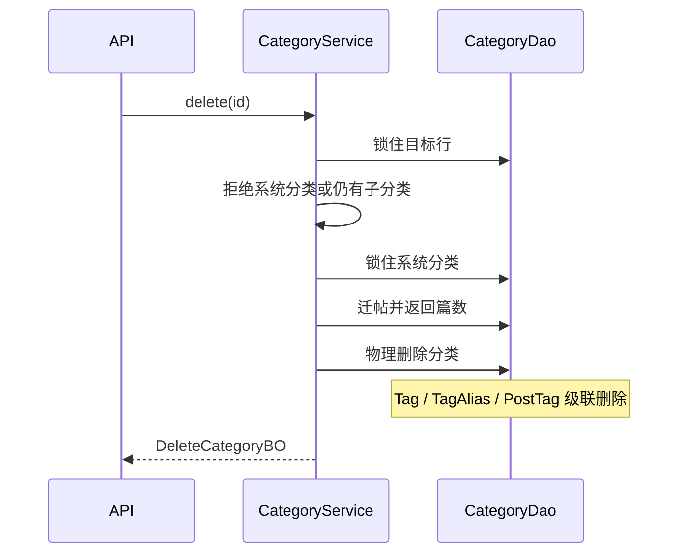

# 分类模块（Category）

树形分类、系统分类「未分类」、启用开关、删除分类时把文章迁走。依据 [系统详细设计](../detail-system-design.md)、[概要设计](../system-preliminary-design.md) 与 `app/src/prisma/contract.prisma`。

分类是树：`parentId` 指向父节点，根节点为 `null`。系统分类看列 `isSystem`，启用看列 `isActive`。

## 职责与边界

| 本模块做 | 本模块不做 |
|----------|------------|
| 分类的增删改查与整树读取 | 标签的增删改查（Tag） |
| 保证存在且保护 `isSystem` 的「未分类」 | 文章正文、状态、版本（Content / Post） |
| 用 `isActive` 启停分类；管理端仍能看到停用节点 | 标签的启停（Tag.`isActive` 归标签模块） |
| 删除前把该分类下的文章改挂到系统分类 | Changelog、Page 不挂分类 |
| 删除分类后，其标签随外键级联消失 | 分类历史 slug 的 301（前台只对 `ContentDetail.slug` 做 301） |
| 为后台树和后续前台导航提供读模型 | 登录鉴权（全局能力，未落地） |

依赖：

- **Post**：`categoryId` 必填，且无 `onDelete`。不先迁帖，数据库会拒绝删除。
- **Tag**：`categoryId` 必填，`onDelete: Cascade`。物理删除分类时，该分类的标签、`TagAlias`、`PostTag` 一并删除。迁走的文章不再保留这些标签。
- **前台**：后续按 `/categories/[slug]` 消费当前 `slug`。本模块在写成功后触发按需重签，不实现页面。

## 数据契约

表 `categories`（模型 `Category`）：

| 列 | 约束 | 说明 |
|----|------|------|
| `id` | uuid，主键 | |
| `name` | 全局唯一，非空 | 展示名，可中文 |
| `slug` | 全局唯一，非空 | URL 段，创建时规范化 |
| `description` | 可空 | 空串入库为 `null` |
| `isActive` | 布尔，默认 `true` | 前台导航与文章选择器是否露出。不是软删 |
| `isSystem` | 布尔，默认 `false` | 系统种子行。管理接口不能把它写成 `true` |
| `parentId` | 可空，自关联 | `null` 为根；删除父节点时数据库 Restrict |
| `createdAt` / `updatedAt` | 非空 | |
| `deletedAt` | 可空 | 与内容表同构。本模块删除走物理删除，正常数据保持 `null`。读取一律 `deletedAt IS null` |

关系：`children`、`parent`、`posts`、`tags`。

种子（恰好一行，以 `slug` 识别）：

| 字段 | 值 |
|------|----|
| `name` | `未分类` |
| `slug` | `uncategorized` |
| `parentId` | `null` |
| `description` | `null` |
| `isActive` | `true` |
| `isSystem` | `true` |

全表恰好一行 `isSystem = true`。种子缺失或不止一行时，删除事务抛 `InternalError`（「系统分类不存在」），不在请求里补插。

派生字段（不落列）：

- `postCount`：该分类下文章数（含草稿与归档）
- `tagCount`：该分类下 `deletedAt IS null` 的标签数（含 `isActive = false` 的标签）

同级顺序：`createdAt` 升序，再按 `name` 升序。无排序列。

### 分层类型

每层只认本层类型，边界处转换。有树列表，因此有 Item；单条完整对象用 Detail；删除结果用 `DeleteCategory*`，不叫 Detail。列表无过滤、无分页，因此没有 Query。

**DTO**（`category.schema.ts`，Zod **output**）

`createCategorySchema`：

| 字段 | 规则 |
|------|------|
| `name` | `trim`，1–64 |
| `slug` | `trim` + 小写，1–64，`^[a-z0-9]+(?:-[a-z0-9]+)*$` |
| `description` | 可选；`trim`，最长 500；缺省或空串 → `null` |
| `parentId` | 可选 uuid；缺省表示根 |
| `isActive` | 可选布尔，默认 `true` |

`updateCategorySchema`：上述字段皆可选。`description`、`parentId` 可显式 `null`（清空简介、改挂到根）。`isActive` 为布尔。`refine`：至少一项。省略表示不改。两个 schema 都不接收 `isSystem`。

`categoryIdParamsSchema`：`id` 为 uuid。

类型名：`CreateCategoryDTO`、`UpdateCategoryDTO`、`CategoryIdParams`。

**DAO 行** `CategoryDAO`：表列全集（含 `isActive`、`isSystem`、`deletedAt`）。

**PO**

- `CreateCategoryPO`：`name`、`slug`、`description`、`parentId`、`isActive`。`isSystem` 固定写 `false`
- `UpdateCategoryPO`：可改字段同上，按本次有改动的字段提交。不写 `isSystem`

**BO / VO** 字段相同，在 Service→API 边界做一次映射。

`CategoryItemBO` / `CategoryItemVO`：

| 字段 | 类型 |
|------|------|
| `id` / `name` / `slug` | `string` |
| `description` | `string \| null` |
| `parentId` | `string \| null` |
| `isActive` / `isSystem` | `boolean` |
| `postCount` / `tagCount` | `number` |
| `children` | 同型数组 |

`CategoryListBO` / `CategoryListVO` = 根节点数组（子节点只出现在 `children`）。

`CategoryDetailBO` / `CategoryDetailVO`：Item 去掉 `children`，另加 `createdAt`、`updatedAt`。

`DeleteCategoryBO` / `DeleteCategoryVO`：`id`、`migratedPostCount`。

## 接口清单

管理端走 Route Handler + `apiHandler`。成功 HTTP 200，`ApiResult.data` 为下表 VO。页面用 `Http` + TanStack Query，queryKey：`["categories"]`。

| 方法 | 路径 | 入参 | `data` |
|------|------|------|--------|
| `GET` | `/api/v1/categories` | 无 | `CategoryListVO` |
| `POST` | `/api/v1/categories` | `CreateCategoryDTO` | `CategoryDetailVO` |
| `GET` | `/api/v1/categories/[id]` | `CategoryIdParams` | `CategoryDetailVO` |
| `PATCH` | `/api/v1/categories/[id]` | params + `UpdateCategoryDTO` | `CategoryDetailVO` |
| `DELETE` | `/api/v1/categories/[id]` | `CategoryIdParams` | `DeleteCategoryVO` |

前台 RSC 以后直接调 `CategoryService.listActiveTree()` / `getBySlug()`，不另开写接口。`listActiveTree()` 去掉 `isActive = false` 的节点及其全部子孙。`getBySlug()` 对停用分类返回不存在。

错误（`message` 给调用方，`code` 用全局短语）：

| 场景 | 错误 | message |
|------|------|---------|
| id 或父分类不存在，或已软删 | `NotFoundError` | `分类不存在` / `父分类不存在` |
| `name` 与其它行冲突 | `ConflictError` | `分类名称已存在` |
| `slug` 与其它行冲突 | `ConflictError` | `分类 slug 已存在` |
| 删除系统分类 | `ConflictError` | `系统分类不可删除` |
| 修改系统分类的 name、slug、parent 或 `isActive` | `ConflictError` | `系统分类不可修改名称、slug、层级或启用状态` |
| 仍有子分类 | `ConflictError` | `请先删除子分类` |
| 父级是自身或子孙 | `BadRequestError` | `不能把分类移到自身或其子分类下` |
| 父级是系统分类 | `BadRequestError` | `不能在系统分类下创建子分类` |
| 系统分类缺失或不止一行 | `InternalError` | `系统分类不存在` |
| 形状不符 | `ValidationError` | Zod `fieldErrors` |
| 并发下唯一约束 | `ConflictError` | 全局 Prisma 映射 |

Service 先按 `name`、`slug` 分别查询，以便 message 能区分两者。并发插入仍可能落到唯一约束映射。

## 领域规则

1. **全局唯一。** `name`、`slug` 在整棵森林中唯一，不是「仅同级唯一」。
2. **slug 是当前 URL 段。** 允许修改。本模块不保留旧 slug；改 slug 或删除后，旧 `/categories/{old}` 由前台按未命中处理。写成功后对旧 slug 与新 slug 调用 `revalidatePath`。
3. **系统分类是迁移终点，不是分支。** `isSystem = true` 的种子行即「未分类」。不可删除；`name`、`slug`、`parentId`、`isActive` 不可变成别的值；不可作为 `parentId`；简介可改。接口不接收 `isSystem`，新建行恒为 `false`。表单重复提交与当前相同的 name、slug、`parentId: null` 或 `isActive: true` 视为未改动，不报错。
4. **父级必须是现存分类。** 不能是自身，不能是自己的子孙（沿 `parentId` 向上走到根），不能是系统分类。父级可以是已停用分类。改父级不移动文章，也不移动标签。
5. **有子分类则拒绝删除。** 先删叶子。子分类上的文章留在子分类，不在删父级时被迁走。
6. **删除会迁帖并丢掉该分类的标签。** 该 `categoryId` 下的全部文章改挂到系统分类。文章行、正文、状态保留。该分类的标签及 `PostTag` 随级联删除，迁走的文章不再带这些标签。
7. **停用不是删除。** `isActive = false` 的分类仍留在管理端树里，其下文章仍挂着。前台树去掉该节点及其子孙，已停用父级下的启用子分类也不露出。停用父级不改写子级的 `isActive`。系统分类不能停用。
8. **Changelog、Page 无分类外键。** 删除分类不碰它们。标签的 `isActive` 由标签模块解释。

## 分层落点

| 路径 | 职责 |
|------|------|
| `app/src/prisma/contract.prisma` | 模型已定，本模块不改表 |
| `app/src/lib/schema/category.schema.ts` | 三个 schema 与 DTO |
| `app/src/types/category.type.ts` | VO、BO |
| `app/src/lib/dao/category.dao.ts` | 行读写、计数、迁帖；方法接受事务客户端 |
| `app/src/lib/service/category.service.ts` | 规则、组树、事务、BO |
| `app/src/app/api/v1/categories/route.ts` | `GET` 列表、`POST` |
| `app/src/app/api/v1/categories/[id]/route.ts` | `GET` / `PATCH` / `DELETE` |
| `app/src/app/(admin)/admin/category/page.tsx` | 已挂页面 |
| `app/src/components/admin/category/index.tsx` | 树与表单 |

`CategoryDao` 读出扁平行（过滤 `deletedAt`），另以两次聚合取出 `postCount`、`tagCount`。`CategoryService.listTree()` 按 `parentId` 组出管理端全树。`listActiveTree()` 在组树后剪掉 `isActive = false` 的节点及其子孙。

DAO 方法：`findById`、`findBySlug`、`findSystem`、`listAll`、`countChildren`、`countPostsByCategory`、`countTagsByCategory`、`insert`、`update`、`delete`、`migratePosts(fromId, toId)`。

管理端：

- 树表展示名称、slug、启用状态、文章数、标签数。系统分类不提供删除和停用。
- 新建 / 编辑：名称、slug、简介、父分类、启用。父级选项排除自身、子孙和系统分类。
- 删除确认写明：文章将迁到系统分类「未分类」，该分类下的标签会删除。成功后展示 `migratedPostCount`，并失效 `["categories"]`。

## 关键事务

创建、修改父级、删除都放在交互式事务里。删除是唯一会改两张业务表的事务。

删除步骤：

1. `SELECT … FROM categories WHERE id = $id FOR UPDATE`。无行或 `deletedAt` 非空 → `分类不存在`。
2. `isSystem` → `系统分类不可删除`。
3. 存在 `parentId = id` 且未软删的子行 → `请先删除子分类`。
4. `SELECT … FROM categories WHERE is_system = true AND deleted_at IS NULL FOR UPDATE`。不是恰好一行 → `系统分类不存在`。
5. `UPDATE posts SET category_id = 系统分类 id WHERE category_id = $id`，取行数作为 `migratedPostCount`。
6. `DELETE FROM categories WHERE id = $id`。数据库级联删除该分类的 Tag、TagAlias、PostTag。
7. 提交后对 `/categories/{slug}` 做 `revalidatePath`。

`FOR UPDATE` 与文章插入所需的外键锁冲突，因此锁持有期间新文章挂不上这条分类；提交后分类已不在，插入会失败而不会留下孤儿。

修改父级时同样锁住当前行，再确认新父级存在、不是系统分类，且从新父级沿父链向上不会遇到当前 id。停用分类时只更新 `isActive`，不迁帖。

## 测试

用例正文落在 `doc/test-case/unit/category.test.md`（实现时按 [测试约定](../test-case/README.md) 展开）。下表是本模块的行为契约。断言 HTTP 状态与 `error.code`。不覆盖标签 CRUD、文章编辑、前台 301。

| 编号 | 优先级 | 契约 |
|------|--------|------|
| CAT-POST-001 | P0 | 合法 body 创建根分类，返回 Detail，`parentId` 为 `null`，`isSystem` 为 false，`isActive` 为 true |
| CAT-POST-002 | P0 | `parentId` 指向现存分类时，列表中该节点出现在父级 `children` |
| CAT-POST-003 | P0 | 空 name、非法 slug、非法 uuid → 422 `Validation Error` |
| CAT-POST-004 | P0 | 重复 name → 409 `Conflict`，message 为名称已存在 |
| CAT-POST-005 | P0 | 重复 slug → 409 `Conflict`，message 为 slug 已存在；大写 slug 先变成小写再判重 |
| CAT-POST-006 | P0 | 父分类不存在 → 404 `Not Found` |
| CAT-POST-007 | P0 | `parentId` 为系统分类 → 400 `Bad Request` |
| CAT-POST-008 | P0 | `isActive: false` 创建成功；管理端列表仍返回该节点，`isSystem` 为 false |
| CAT-GET-001 | P0 | 列表只在根上返回森林；同级按 `createdAt`、`name` 排序；含系统分类且 `isSystem` 为 true，并含已停用分类 |
| CAT-GETID-001 | P0 | 详情含 `createdAt`、`updatedAt`、`isActive`、`isSystem`、`postCount`、`tagCount`，不含 `children` |
| CAT-GETID-002 | P0 | 未知 id → 404 |
| CAT-PATCH-001 | P0 | 修改简介与父级成功；文章仍挂在本分类 |
| CAT-PATCH-002 | P0 | 把节点挂到自己的子孙 → 400 |
| CAT-PATCH-003 | P0 | 修改系统分类的 name、slug 或 `isActive` → 409；只改简介 → 200 |
| CAT-PATCH-004 | P0 | 空 body → 422 |
| CAT-PATCH-005 | P0 | 普通分类 `isActive` 改为 false → 200，文章仍挂在该分类 |
| CAT-DELETE-001 | P0 | 分类下有文章和标签：文章 `categoryId` 变为系统分类，`migratedPostCount` 正确，该分类标签与 `PostTag` 消失，文章行仍在 |
| CAT-DELETE-002 | P0 | 删除系统分类 → 409，行仍在 |
| CAT-DELETE-003 | P0 | 仍有子分类 → 409，文章不被迁走 |
| CAT-DELETE-004 | P0 | 未知 id → 404 |
