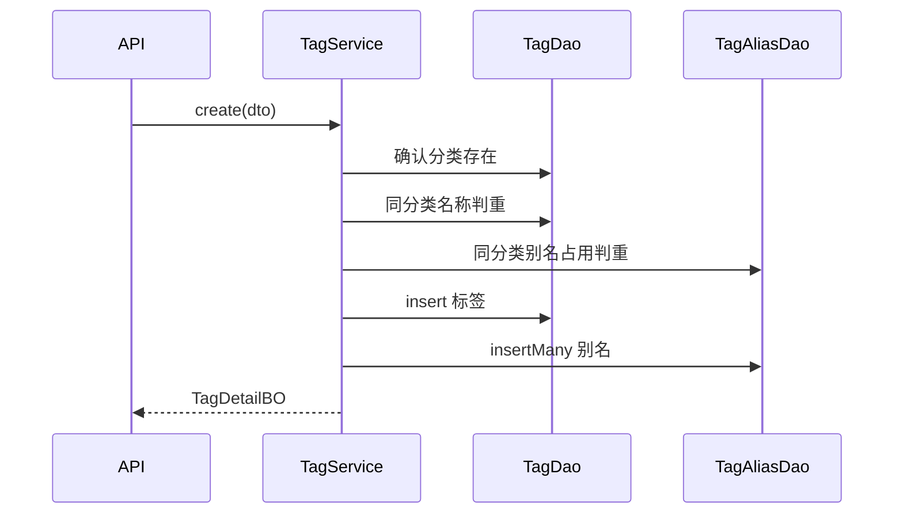

# 标签模块（Tag）

分类内聚标签、启用开关、别名检索。依据 [系统详细设计](../detail-system-design.md)、[概要设计](../system-preliminary-design.md) 与 `app/src/prisma/contract.prisma`。

标签必属一个分类：同一分类下 `name` 唯一，跨分类可同名。无 slug。启用看列 `isActive`。别名挂在 `TagAlias`，用于按别名找到标签；文章经 `PostTag` 挂标签，由文章模块消费，本模块不写挂载接口。

## 职责与边界

| 本模块做 | 本模块不做 |
|----------|------------|
| 标签的增删改查与按分类 / 关键词列表 | 分类树与系统分类（Category） |
| 标签别名的写入与随标签级联删除 | 文章挂 / 卸标签（`PostTag`，归 Post） |
| 用 `isActive` 启停标签；管理端仍能看到停用标签 | Changelog、Page 挂标签（契约上不存在） |
| 为后台列表与文章选择器提供读模型 | 标签 URL / 301（契约无 slug；前台路径未定） |
| 删除标签时由数据库级联去掉别名与 `PostTag` | 登录鉴权（全局能力，未落地） |

依赖：

- **Category**：`categoryId` 必填，`onDelete: Cascade`。分类必须存在且未软删。物理删除分类时，该分类下的标签、别名、`PostTag` 一并消失（由分类模块事务触发，本模块不另开删除入口）。
- **Post / PostTag**：删标签时 `PostTag` 级联删除，文章行保留、不再带该标签。挂载规则（仅本分类标签）由 Post 模块校验。
- **前台**：标签无 slug，本模块不调用 `revalidatePath`。文章侧缓存失效由 Post 模块负责。

## 数据契约

### 表 `tags`（模型 `Tag`）

| 列 | 约束 | 说明 |
|----|------|------|
| `id` | uuid，主键 | |
| `name` | 非空；与 `categoryId` 联合唯一 | 展示名，可中文。跨分类可同名 |
| `isActive` | 布尔，默认 `true` | 前台导航与文章选择器是否露出。不是软删 |
| `categoryId` | 非空，外键 → `categories`，`onDelete: Cascade` | 所属分类 |
| `createdAt` / `updatedAt` | 非空 | |
| `deletedAt` | 可空 | 与内容表同构。本模块删除走物理删除，正常数据保持 `null`。读取一律 `deletedAt IS null` |

关系：`category`、`posts`（`PostTag`）、`tagAlias`。

### 表 `tag_aliases`（模型 `TagAlias`）

| 列 | 约束 | 说明 |
|----|------|------|
| `id` | uuid，主键 | |
| `name` | 非空 | 别名，可中文。契约**无**唯一索引；同分类判重由 Service 保证 |
| `tagId` | 非空，外键 → `tags`，`onDelete: Cascade` | 所属标签 |
| `createdAt` / `updatedAt` | 非空 | |
| `deletedAt` | 可空 | 本模块不单独软删别名；随标签物理删除。读取别名一律 `deletedAt IS null` |

关系：`tag`。

`PostTag` 表由 Post 模块读写；本模块删除标签时依赖其 `onDelete: Cascade`，不直接操作该表（计数除外）。

派生字段（不落列）：

- `postCount`：该标签下 `PostTag` 行数（含草稿与归档文章）
- `aliases`：详情中返回的别名列表；列表项可用 `aliasCount`

排序：`createdAt` 升序，再按 `name` 升序。无排序列。

本模块不改 `contract.prisma`。

### 分层类型

每层只认本层类型，边界处转换。有过滤列表，因此有 Query 与 Item；单条完整对象用 Detail；删除结果用 `DeleteTag*`，不叫 Detail。

**DTO**（`tag.schema.ts`，Zod **output**）

`queryTagSchema`：

| 字段 | 规则 |
|------|------|
| `categoryId` | 可选 uuid；缺省表示不按分类过滤（管理端全量） |
| `q` | 可选；`trim`，最长 64；空串视为未传。匹配标签 `name` 或任一别名 `name`（子串，大小写不敏感） |
| `isActive` | 可选布尔；缺省表示不过滤（管理端含停用）。文章选择器传 `true` |

`createTagSchema`：

| 字段 | 规则 |
|------|------|
| `name` | `trim`，1–64 |
| `categoryId` | uuid，必填 |
| `isActive` | 可选布尔，默认 `true` |
| `aliases` | 可选字符串数组；每项 `trim`，1–64；缺省或 `[]` 表示无别名；schema 内先去重（保留首次出现顺序） |

`updateTagSchema`：

| 字段 | 规则 |
|------|------|
| `name` | 可选；规则同创建 |
| `isActive` | 可选布尔 |
| `aliases` | 可选字符串数组；规则同创建。**出现则整表替换**该标签下全部别名；省略表示不改别名；`[]` 表示清空 |

`refine`：至少一项。不接收 `categoryId`（创建后不可改挂分类）。

`tagIdParamsSchema`：`id` 为 uuid。

类型名：`QueryTagDTO`、`CreateTagDTO`、`UpdateTagDTO`、`TagIdParams`。

**DAO 行**

- `TagDAO`：`tags` 表列全集（含 `deletedAt`）
- `TagAliasDAO`：`tag_aliases` 表列全集

**PO**

- `CreateTagPO`：`name`、`categoryId`、`isActive`
- `UpdateTagPO`：可改 `name`、`isActive`，按本次有改动的字段提交
- `CreateTagAliasPO`：`name`、`tagId`
- 别名替换：先按 `tagId` 物理删再批量 `insert`（同事务）

**BO / VO** 字段相同，在 Service→API 边界做一次映射。

`TagItemBO` / `TagItemVO`：

| 字段 | 类型 |
|------|------|
| `id` / `name` | `string` |
| `categoryId` | `string` |
| `isActive` | `boolean` |
| `postCount` / `aliasCount` | `number` |

`TagListBO` / `TagListVO` = `TagItem*` 数组。

`TagAliasItemBO` / `TagAliasItemVO`：`id`、`name`。

`TagDetailBO` / `TagDetailVO`：Item 去掉 `aliasCount`，另加 `createdAt`、`updatedAt`、`aliases`（`TagAliasItem*` 数组，按 `createdAt`、`name` 排序）。

`DeleteTagBO` / `DeleteTagVO`：`id`、`detachedPostCount`（删除前该标签的 `PostTag` 行数）。

## 接口清单

管理端走 Route Handler + `apiHandler`。成功 HTTP 200，`ApiResult.data` 为下表 VO。页面用 `Http` + TanStack Query，queryKey：`["tags"]`（带 query 时一并写入 key，如 `["tags", query]`）。

| 方法 | 路径 | 入参 | `data` |
|------|------|------|--------|
| `GET` | `/api/v1/tags` | `QueryTagDTO`（searchParams） | `TagListVO` |
| `POST` | `/api/v1/tags` | `CreateTagDTO` | `TagDetailVO` |
| `GET` | `/api/v1/tags/[id]` | `TagIdParams` | `TagDetailVO` |
| `PATCH` | `/api/v1/tags/[id]` | params + `UpdateTagDTO` | `TagDetailVO` |
| `DELETE` | `/api/v1/tags/[id]` | `TagIdParams` | `DeleteTagVO` |

前台 / 文章选择器以后可直接调 `TagService.list({ categoryId, isActive: true, q? })`，不另开写接口。停用标签不出现在 `isActive: true` 的结果里；管理端默认不过滤 `isActive`。

错误（`message` 给调用方，`code` 用全局短语）：

| 场景 | 错误 | message |
|------|------|---------|
| 标签 id 不存在或已软删 | `NotFoundError` | `标签不存在` |
| `categoryId` 指向的分类不存在或已软删 | `NotFoundError` | `分类不存在` |
| 同分类下 `name` 与其它标签冲突 | `ConflictError` | `标签名称已存在` |
| 别名与同分类下某标签 `name` 冲突 | `ConflictError` | `别名与标签名称冲突` |
| 别名与同分类下其它别名冲突（含同标签内重复已在 schema 去重后仍撞到其它标签） | `ConflictError` | `标签别名已存在` |
| 别名与所属标签自身 `name` 相同 | `BadRequestError` | `别名不能与标签名称相同` |
| 形状不符 | `ValidationError` | Zod `fieldErrors` |
| 并发下 `(categoryId, name)` 唯一约束 | `ConflictError` | 全局 Prisma 映射 |

Service 在写前按分类查询名称与别名，以便 message 能区分。并发插入标签仍可能落到唯一约束映射；别名无 DB 唯一索引，以事务内先查后写为准。

## 领域规则

1. **分类内聚，名称联合唯一。** `@@unique([categoryId, name])`。跨分类允许同名（如「苹果」分属水果与科技）。
2. **无 slug。** 不以 URL 段标识标签；不保留历史名称；不触发按标签路径的 `revalidatePath`。
3. **必须挂在现存分类上。** 创建时 `categoryId` 必须对应 `deletedAt IS null` 的分类（含系统分类「未分类」、已停用分类）。创建后不可改 `categoryId`，避免文章仍挂旧分类标签却指向新分类。
4. **别名服务于检索。** `q` 命中标签名或任一同分类别名即纳入结果。同一分类内：别名不得等于任一标签的 `name`，不得与其它别名同名，不得与所属标签自身 `name` 相同。跨分类别名可同名。契约表无别名唯一索引，判重在 Service。
5. **别名随标签生命周期。** 无独立别名 REST 资源。创建可带 `aliases`；更新时若传 `aliases` 则事务内整表替换（先删后插）；删标签时数据库级联删别名。
6. **停用不是删除。** `isActive = false` 的标签仍留在管理端列表与详情中，已挂文章的 `PostTag` 保留。`isActive: true` 的列表与文章选择器不露出停用标签。停用标签不改写别名。
7. **删除是物理删除。** 先统计 `PostTag` 行数作为 `detachedPostCount`，再 `DELETE` 标签行；别名与 `PostTag` 级联删除。文章行、正文、分类归属保留。不把文章改挂其它标签。
8. **Changelog、Page 不挂标签。** 本模块不感知这两种内容。`PostTag` 仅文章模块写入。
9. **分类删除的级联。** 分类物理删除时标签消失，属 Category 模块事务；本模块列表自然不再返回。

## 分层落点

| 路径 | 职责 |
|------|------|
| `app/src/prisma/contract.prisma` | 模型已定，本模块不改表 |
| `app/src/lib/schema/tag.schema.ts` | Query / Create / Update / Id params 与 DTO |
| `app/src/types/tag.type.ts` | VO、BO、PO、DAO 行类型 |
| `app/src/lib/dao/tag.dao.ts` | 标签行读写、按条件列表、`postCount` / 别名计数；方法接受事务客户端 |
| `app/src/lib/dao/tag-alias.dao.ts` | 别名读写、按 tag 删除、同分类别名占用查询 |
| `app/src/lib/service/tag.service.ts` | 规则编排、事务、BO |
| `app/src/app/api/v1/tags/route.ts` | `GET` 列表、`POST` |
| `app/src/app/api/v1/tags/[id]/route.ts` | `GET` / `PATCH` / `DELETE` |
| `app/src/app/(admin)/admin/tag/page.tsx` | 已挂页面 |
| `app/src/components/admin/tag/index.tsx` | 列表与表单 |
| `app/src/query/tag.query.ts` | TanStack Query 封装 |

`TagDao` 读出扁平行（过滤 `deletedAt`），列表可联表或二次查询带上 `postCount`、`aliasCount`。详情加载别名列表。`TagService.list(query)` 组合过滤；`create` / `update` / `delete` 在交互式事务中执行。

DAO 方法（标签）：`findById`、`findByCategoryAndName`、`list(query)`、`countPostsByTag`、`countAliasesByTag`、`insert`、`update`、`delete`。

DAO 方法（别名）：`listByTagId`、`listNamesByCategoryId`（用于判重）、`deleteByTagId`、`insertMany`。

管理端：

- 列表：名称、所属分类、启用状态、文章数、别名数；可按分类与关键词过滤。
- 新建 / 编辑：名称、所属分类（仅新建可选）、启用、别名多值输入。编辑不可改分类。
- 删除确认写明：文章将去掉该标签（`PostTag` 删除），文章本身保留。成功后展示 `detachedPostCount`，并失效 `["tags"]`。

## 关键事务

创建（含别名）、改名 / 替换别名、删除放在交互式事务里。

创建步骤：

1. 确认 `categoryId` 对应分类存在且 `deletedAt IS null`，否则 `分类不存在`。
2. 同分类下是否已有同名标签 → `标签名称已存在`。
3. 校验每条别名：不得等于本标签 `name`；不得等于同分类任一标签名 → `别名与标签名称冲突`；不得等于同分类已有别名 → `标签别名已存在`。
4. `INSERT` 标签；若有别名则批量 `INSERT`。
5. 组装 Detail（含 `postCount = 0` 与别名列表）返回。

更新步骤：

1. `SELECT … FROM tags WHERE id = $id FOR UPDATE`。无行或已软删 → `标签不存在`。
2. 若改 `name`：在同分类下判重（排除自身）。
3. 若传 `aliases`：按替换后的全集做与创建相同的别名校验（自身旧别名将删除，不占位）；`deleteByTagId` 后 `insertMany`。
4. 按需 `UPDATE` 标签行。
5. 返回最新 Detail。

删除步骤：

1. `SELECT … FROM tags WHERE id = $id FOR UPDATE`。无行或已软删 → `标签不存在`。
2. 统计 `PostTag` 行数 → `detachedPostCount`。
3. `DELETE FROM tags WHERE id = $id`。数据库级联删除 `TagAlias`、`PostTag`。
4. 返回 `DeleteTagBO`。

`FOR UPDATE` 持有期间同 id 的并发更新 / 删除会排队；提交后该行不在，后续请求得 `标签不存在`。

## 测试

用例正文落在 [tag.test.md](../test-case/unit/tag.test.md)（接口单元测试，约定见 [测试文档](../test-case/README.md)）。下表是契约索引。断言 HTTP 状态与 `error.code`。不覆盖文章挂标签 UI、分类删除级联、鉴权。

| 编号 | 优先级 | 契约 |
|------|--------|------|
| TAG-POST-001 | P0 | 合法 body 创建标签，返回 Detail，`isActive` 为 true，`aliases` 为 `[]`，`postCount` 为 0 |
| TAG-POST-002 | P0 | 带 `aliases` 创建成功；详情别名按序返回；列表 `aliasCount` 正确 |
| TAG-POST-003 | P0 | 空 name、非法 uuid、别名超长 → 422 `Validation Error` |
| TAG-POST-004 | P0 | 同分类重复 name → 409，message 为标签名称已存在 |
| TAG-POST-005 | P0 | 不同分类同名 → 200，两条皆存在 |
| TAG-POST-006 | P0 | `categoryId` 不存在 → 404，message 为分类不存在 |
| TAG-POST-007 | P0 | 别名等于自身 name → 400，message 为别名不能与标签名称相同 |
| TAG-POST-008 | P0 | 别名等于同分类其它标签 name → 409，message 为别名与标签名称冲突 |
| TAG-POST-009 | P0 | 别名等于同分类其它标签的别名 → 409，message 为标签别名已存在 |
| TAG-POST-010 | P0 | `isActive: false` 创建成功；管理端列表仍返回该节点 |
| TAG-GET-001 | P0 | 无 query 返回全部未软删标签（含停用）；按 `createdAt`、`name` 排序 |
| TAG-GET-002 | P0 | `categoryId` 只返回该分类下标签 |
| TAG-GET-003 | P0 | `q` 命中名称或别名；`isActive=true` 不含停用标签 |
| TAG-GETID-001 | P0 | 详情含 `createdAt`、`updatedAt`、`aliases`、`postCount`，不含 `aliasCount` |
| TAG-GETID-002 | P0 | 未知 id → 404 |
| TAG-PATCH-001 | P0 | 改 name 与 `isActive` 成功；`categoryId` 不变 |
| TAG-PATCH-002 | P0 | body 含 `categoryId` → 422（schema 不接收） |
| TAG-PATCH-003 | P0 | 同分类改名为已存在名 → 409 |
| TAG-PATCH-004 | P0 | `aliases: []` 清空别名；省略 `aliases` 时旧别名保留 |
| TAG-PATCH-005 | P0 | 空 body → 422 |
| TAG-DELETE-001 | P0 | 有 `PostTag` 时删除成功，`detachedPostCount` 正确；再 GET 404；文章行仍在 |
| TAG-DELETE-002 | P0 | 未知 id → 404 |
