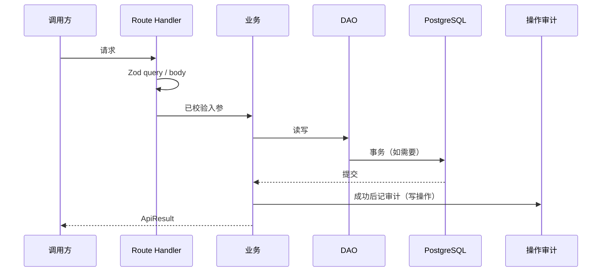

# {模块中文名} — {CodeName}

> 模板。复制为本目录下 `{module}.md` 后替换占位。模块划分见 [系统概要设计](../system-primary-design.md)。错误约定见 [全局统一错误处理](../excerption.md)。请求封装见 [Fetch 封装](../http.md)。

## 1. 范围

| 项 | 说明 |
| ---- | ---- |
| `SystemModule` | `{route \| taxonomy \| content \| syslog \| media \| auth}` |
| 做什么 | |
| 不做什么 | |
| 依赖模块 | |
| 被谁依赖 | |

## 2. 场景

| 角色 | 场景 | 入口 | 结果 |
| ---- | ---- | ---- | ---- |
| 后台 | | CSR / `/api/...` | `ApiResult` |
| 公开站 | | SSR，不走 `Http` | 页面状态 |

## 3. 数据模型

表、字段、约束、索引。与 `contract.prisma` 不一致时以合同为准并回写本文。

```prisma
// 仅列本模块相关 model / enum
```

| 规则 | 说明 |
| ---- | ---- |
| 唯一 | |
| 外键 / Restrict | |
| 默认值 | |

## 4. 接口

每个写操作经 `apiHandler`。声明了 `query` / `body` 的必须 Zod 通过后才进业务。

| 方法 | 路径 | query schema | body schema | 成功 `data` | 权限 |
| ---- | ---- | ---- | ---- | ---- | ---- |
| GET | `/api/...` | | — | | |
| POST | `/api/...` | — | | | |

本模块错误（只写特有场景，不重复全局表）：

| 场景 | 抛出 |
| ---- | ---- |
| 校验失败 | `apiHandler` → `BadRequestError` |
| | |

## 5. 流程



分条写分支：未认证、无权限、未找到、冲突、约束、事务失败。

## 6. 权限与审计

| 操作 | 会话 | 权限 | 操作审计 | 登录审计 |
| ---- | ---- | ---- | ---- | ---- |
| 读 | | | 否 | 否 |
| 写 | 必须 | | 事务成功后 | 否 |

## 7. 前端

| 面 | 约定 |
| ---- | ---- |
| 后台 | CSR，`Http` + TanStack Query；`queryKey`： |
| 公开站 | SSR，服务端读 DAO / 查询，不走 `Http` |
| 表单 | 可与接口共用 Zod；服务端仍须再验 |

## 8. 文件

| 层 | 路径 |
| ---- | ---- |
| schema | `app/src/lib/schema/{module}.schema.ts` |
| DAO | `app/src/lib/dao/{module}.dao.ts` |
| query / 业务 | `app/src/query/{module}.query.ts` |
| Route | `app/src/app/api/.../route.ts` |
| 后台页 | |
| 公开页 | |

## 9. 待决
