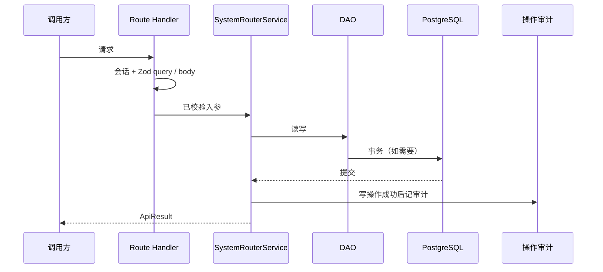

# 系统路由模块 — SystemRouter

> 按 [_skeleton.md](./_skeleton.md) 填写。概要见 [系统概要设计](../system-primary-design.md) §3.2。错误见 [全局统一错误处理](../excerption.md)。请求见 [Fetch 封装](../http.md)。相关流见 [核心数据流](../core-data-flows.md) §3、§4。

本文为重设计后的目标合同。`app/src/prisma/contract.prisma` 尚未同步时以本文为准；落地后回写合同。

## 1. 范围

| 项 | 说明 |
| ---- | ---- |
| `SystemModule` | `route` |
| 做什么 | 一张表、两棵逻辑树（`scope=site` / `scope=admin`）维护公开导航与后台菜单 |
| 不做什么 | 不存页面正文；不做登录；不替代内容发布状态；不渲染后台 App Router 页面 |
| 依赖模块 | `auth`（后台读写）；后台菜单剪枝依赖权限模块（尚未接入） |
| 被谁依赖 | 公开站 SSR、后台菜单、内容按 path 落页 |

公开页由路由节点命中后交内容模块取正文。后台页由 Next 文件渲染，本模块只提供菜单 href（须对上已有 `app/(admin)/admin/**/page.tsx`）。

## 2. 场景

| 角色 | 场景 | 入口 | 结果 |
| ---- | ---- | ---- | ---- |
| 后台 | 读编辑树 | CSR `GET /api/admin/v1/system-router` | 完整树（含未启用、空分组） |
| 后台 | 读导航菜单 | 布局预取（无独立 REST） | 只取 `scope=admin`；滤 `isActive` + `permissionIds`，再按 §3.1 剪枝；绝对 path 由节点段拼接 |
| 后台 | 增删改节点 | CSR `/api/admin/v1/system-router` | `ApiResult`；写成功后操作审计 |
| 公开站 | 导航 / 按 path 匹配页面节点 | SSR | 只取 `scope=site`；命中启用 `page` 或 404，不走 `Http` |

## 3. 数据模型

```prisma
enum RouterScope {
  site
  admin
}

enum RouterType {
  group
  page
}

model SystemRouter {
  id             String               @id @default(uuid())
  name           String
  scope          RouterScope?
  path           String?
  type           RouterType           @default(page)
  icon           String?
  parentId       String?              @map("parent_id")
  isActive       Boolean              @default(true) @map("is_active")
  sort           Int                  @default(0) @map("sort")
  permissionIds  String[]             @default([]) @map("permission_ids")
  createdAt      TimestamptzString    @default(now()) @map("created_at")
  updatedAt      temporal.updatedAtString()

  parent         SystemRouter?        @relation("SystemRouterTree", fields: [parentId], references: [id], onDelete: Restrict)
  children       SystemRouter[]       @relation("SystemRouterTree")

  @@unique([parentId, path])
  @@index([path])
  @@index([parentId])
  @@index([scope])
  @@map("system_router")
}
```

| 规则 | 说明 |
| ---- | ---- |
| 唯一（库） | 同父下 `path` 不重复（`null` 与 `""` 不同）→ `CONFLICT` |
| 唯一（业务） | 同一 `scope` 下组装后的绝对 pathname 不重复 → `CONFLICT` |
| 根 | 每个 `scope` 至多一个根；根必须是 `group` 且 `parentId` 为空；`scope` 仅根节点可写，子节点继承 |
| 外键 / Restrict | 仍有子节点则不可删 → `BAD_REQUEST`（23503）；业务层亦先查子节点 |
| 默认值 | `type=page`，`isActive=true`，`permissionIds=[]`，`sort=0` |

`scope` 列仅根有值；查询某棵树时从该 `scope` 的根向下走。

### 3.1 树规则（只在此节定义）

```text
group（根：site path=null / admin path="admin"）
 ├─ group（path=null，纯菜单分组）
 │    ├─ group（path=段，URL 目录）
 │    └─ page
 ├─ group（path=段，URL 目录，可再嵌套）
 │    ├─ page（path=""，该前缀的索引页）
 │    └─ page（path=段）
 └─ page
```

| 父 \ 子 | 根 group | 子 group | page |
| ---- | ---- | ---- | ---- |
| （无父） | ✓ | | |
| group | | ✓ | ✓ |
| page | | | |

- 仅根可为无父；`page` 为叶。空 `group` 允许落库。
- 根 `site` 的 `path` 必须为 `null`；根 `admin` 的 `path` 必须为 `"admin"`。不要在组装代码里写死 `/admin`。
- 子 `group`：`path=null` 不占 URL 段（菜单分组）；`path` 为一段则占段（旧「目录」）。
- `page` 的 `path` 为一段，或 `""`（索引页，不追加段）。禁止 `null`。
- 路径段：小写字母数字与连字符（`/^[a-z0-9]+(?:-[a-z0-9]+)*$/`）。`""` 仅 `page` 可用。
- **绝对 path**：自根到该节点，把非空 `path` 用 `/` 拼接，前加 `/`。空段不追加。例：根 `admin` + `content` + `category` → `/admin/content/category`；根 `admin` + `page path=""` → `/admin`。
- `permissionIds=[]`：任意已认证后台用户可见该节点。非空则与会话权限求交，无交集则后台导航不可见。公开导航 / path 匹配不看 `permissionIds`。

建树时同级按 `sort` 升序，再 `createdAt`。

导航剪枝（编辑树不做）：先按可见性过滤，再自底向上——空 `group` 不进入结果；`page` 按自身可见性；根 `group` 始终保留（可空 `children`）。组装菜单 VO 时展开根，不输出根自身。

带 `path` 的子 `group` 在导航 VO 中同时有绝对 `path` 与 `children`；侧栏标题可点进该前缀（若存在索引页或约定落地页）。`path=null` 的 `group` 只作分组标题。

### 3.2 示例

后台：

```text
group  scope=admin  path="admin"
 ├─ page  path=""              概览           → /admin
 └─ group path="content"       内容           → /admin/content
      ├─ page path=""          内容概览       → /admin/content
      ├─ page path="category"  分类           → /admin/content/category
      └─ page path="tag"       标签           → /admin/content/tag
```

公开：

```text
group  scope=site  path=null
 ├─ page  path=""              首页           → /
 ├─ page  path="blog"          博客           → /blog
 └─ group path="work"          作品
      └─ page path=""          作品首页       → /work
```

旧类型对照：`set` → 根 `group` + `scope`；无 path 的 `group` 仍为子 `group path=null`；`directory` → 子 `group` 且带 path 段；`page` 不变，目录自身成页用子 `page path=""`。

## 4. 接口

每个写操作经 `apiHandler`。声明了 `query` / `body` 的必须 Zod 通过后才进业务。

后台 REST 基路径：`/api/admin/v1/system-router`。

| 方法 | 路径 | query schema | body schema | 成功 `data` | 权限 |
| ---- | ---- | ---- | ---- | ---- | ---- |
| GET | `/api/admin/v1/system-router` | — | — | `SystemRouterTreeNodeVO[]` | 须会话；不剪枝；两棵根都返回 |
| POST | `/api/admin/v1/system-router` | — | `createSystemRouterSchema` | `void` | 须会话 |
| PATCH | `/api/admin/v1/system-router?id={uuid}` | `id: uuid` | `updateSystemRouterSchema` | `void` | 须会话 |
| DELETE | `/api/admin/v1/system-router?id={uuid}` | `id: uuid` | — | `void` | 须会话 |

```ts
type SystemRouterTreeNodeVO = {
  id: string;
  name: string;
  scope: RouterScope | null;
  path: string | null;
  type: RouterType;
  icon: string | null;
  parentId: string | null;
  isActive: boolean;
  sort: number;
  permissionIds: string[];
  createdAt: string;
  updatedAt: string;
  children: SystemRouterTreeNodeVO[];
};

/** 导航：path 为按 §3.1 拼好的绝对路径；无 path 的 group 为 null；不含根 */
type NavTreeNodeVO = {
  id: string;
  name: string;
  icon: string | null;
  path: string | null;
  children?: NavTreeNodeVO[];
};
```

创建 body（`discriminatedUnion` on `type`）：

| `type` | `parentId` | `scope` | `path` |
| ---- | ---- | ---- | ---- |
| `group` 根 | 空 | 必填 `site` \| `admin` | `site` → `null`；`admin` → `"admin"` |
| `group` 子 | 必填 | 禁止 | 段或 `null` |
| `page` | 必填 | 禁止 | 段或 `""` |

非 REST、服务端直读：

| 能力 | 入口 | 说明 |
| ---- | ---- | ---- |
| 后台导航菜单 | 布局预取 / `SystemRouterQuery.treeForNav` | `scope=admin`；滤 `isActive` + `permissionIds`，§3.1 剪枝；无独立 API |
| 公开导航 | 公开站 SSR | `scope=site`；仅 `isActive`，§3.1 剪枝 |
| 公开 path 匹配 | 公开站 SSR | `scope=site`；按段下钻命中启用 `page` |

本模块错误：

| 场景 | 抛出 |
| ---- | ---- |
| 校验失败（Zod / 父子类型 / path 与类型不符 / 根规则 / 移到子孙） | `BadRequestError` |
| 同父 path 重复，或同 scope 绝对 path 重复 | `ConflictError` |
| 该 scope 根已存在 | `ConflictError` |
| 删除仍有子节点 | `BadRequestError` |
| 节点 / 父节点不存在 | `NotFoundError` |
| 未认证 | 全局会话中间件 / handler（不记操作审计） |

## 5. 流程

后台 REST：



预取 / SSR 不经 `apiHandler` / `Http`，不写操作审计。

### 5.1 创建（POST）

1. `group` 且无 `parentId`：按根规则验 `scope` / `path`；该 `scope` 已有根 → `ConflictError`。
2. 非根：`parentId` 必填，父不存在 → `NotFoundError`；父必须是 `group`；禁止带 `scope`。
3. 按 §3.1 验 `path` 与类型。
4. `insert`；同父 path 冲突或同 scope 绝对 path 冲突 → `ConflictError`。
5. 成功 → 操作审计；`data` 为 `void`。

### 5.2 更新与移动（PATCH）

禁止改 `type`、`scope`。body 至少一字段。

1. 节点不存在 → `NotFoundError`。
2. 改 `path`：须符合当前类型与是否为根（§3.1）。
3. 改 `parentId`：禁迁到自身或子孙；仅根 `group` 的 `parentId` 可为空；非根不可变成根；新父必须是 `group` 且存在。
4. 写库；同父 path 或同 scope 绝对 path 冲突 → `ConflictError`。成功 → 审计。

### 5.3 删除（DELETE）

节点不存在 → `NotFoundError`。仍有子节点 → `BadRequestError`（业务先查，库 `Restrict` 兜底）。成功 → 审计。

### 5.4 读树

| | 编辑树 GET | 后台菜单 | 公开导航 | path 匹配 |
| ---- | ---- | ---- | ---- | ---- |
| 入口 | REST | 布局预取 | SSR | SSR |
| 范围 | 两棵根 | `admin` | `site` | `site` |
| `isActive` | 否 | 滤 | 滤 | 未启用不可穿过 |
| `permissionIds` | 否 | 滤（权限模块未接时暂跳过） | 否 | 否 |
| 剪枝 | 否 | §3.1 | §3.1 | 否，按段下钻 |
| 根 `group` | 保留 | 展开子节点 | 展开 | 根 `path` 若非空则先消耗对应段 |

公开 path 匹配：pathname 去首尾 `/` 后按 `/` 拆段（空串表示 `/`）。只从 `scope=site` 的根下钻：

- `group` 且 `path=null`：穿过，不耗段。
- `group` / `page` 且 `path` 等于当前段：进入并耗一段。
- `page` 且 `path=""`：不耗段；**仅当剩余段为空**才可作为索引命中。
- 段耗尽：优先命中当前节点下启用的索引 `page`（`path=""`），或当前节点本身已是启用 `page` → 交内容模块取已发布正文；否则 404。

后台 URL 不对系统路由做 SSR 匹配。

## 6. 权限与审计

| 操作 | 会话 | 权限 | 操作审计 | 登录审计 |
| ---- | ---- | ---- | ---- | ---- |
| 公开导航 / path 匹配 | 否 | 只解析启用的 `site` 节点 | 否 | 否 |
| 后台导航菜单 | 必须 | `isActive` + `permissionIds`（`[]` = 任意已登录可见） | 否 | 否 |
| 后台编辑树 GET | 必须 | 须登录；不按节点 permission 剪枝 | 否 | 否 |
| 后台写 POST/PATCH/DELETE | 必须 | 须登录 | 事务成功后 | 否 |

## 7. 前端

| 面 | 约定 |
| ---- | ---- |
| 后台编辑树 | CSR，`Http` + TanStack Query；`queryKey`：`['system-router', 'tree']`（待挂） |
| 后台导航菜单 | 布局预取；`queryKey`：`['system-router', 'nav-tree']`；不走编辑树 GET |
| 后台写操作 | mutation 成功后 invalidate 上述 key |
| 公开站 | SSR，服务端 query / DAO，不走 `Http` |
| 表单 | 可与接口共用 Zod；服务端仍须再验 |
| 侧栏 | 无 path 的 `group` 作分组标题；有 path 且有子节点的 `group` 可展开，标题可链到该绝对 path；`page` 为叶子链接 |

后台要出现 `/admin/...`：建 `scope=admin`、`path="admin"` 的根 `group`，再挂目录 `group` 与 `page`。例如内容：根下 `group path=content`，再挂 `page path=category`、`page path=tag`。

## 8. 文件

| 层 | 路径 |
| ---- | ---- |
| schema | `app/src/lib/schema/system-router.schema.ts` |
| DAO | `app/src/lib/dao/system-router.dao.ts` |
| Service | `app/src/lib/service/system-router.service.ts` |
| query | `app/src/query/system-router.query.ts` |
| Route | `app/src/app/api/admin/v1/system-router/route.ts` |
| 类型 | `app/src/type/system-router.type.ts` |
| 后台页 | （路由树管理页，待挂） |
| 公开页 | （`[...path]` 等，待挂） |

## 9. 待决

- 合同与实现尚未按本文迁移（`set` / `directory` 仍在 Prisma）。
- 权限模块接入后：预取后台菜单时传入会话 `userPerms`，按 §3.1 求交剪枝。当前未传则暂不按 `permissionIds` 过滤。
- 后台写操作是否按目标节点 `permissionIds` 细粒度鉴权（当前仅须登录）。
- 后台 `page` 的绝对 path 在 App Router 下无对应文件时，管理页是否仅警告、不拦写入。
