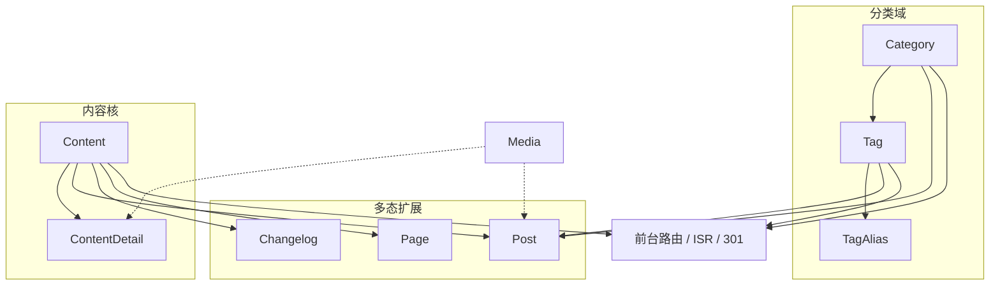

# 系统详细设计

## 1. 模块总览与依赖图

| 模块 | 职责 | 资源 |
|------|------|------|
| 分类 Category | 树形分类、默认「未分类」、删分类时迁帖 | [category.md](./detail-design/category.md) |
| 标签 Tag / TagAlias | 分类内聚标签；跨分类可同名；别名检索 | 待写 |
| 内容基底 Content / ContentDetail | 当前态 + 版本快照、并发保存、回滚 | 待写 |
| 文章 Post | 博客 / 长文；强制分类；仅文章挂标签 | 待写 |
| 更新日志 Changelog | 语义化版本；与标签解耦 | 待写 |
| 独立页面 Page | 布局与组件配置；高频静态化 | 待写 |
| 媒体 Media | 七牛直传、落库、孤儿回收 | 待写 |
| 前台路由 | ISR / 按需重签；历史 slug 的 301 | 待写 |

箭头表示「依赖」。实线：外键或必须先有的领域依赖。虚线：媒体被正文 / 封面引用，无强制 FK。

| 从 | 到 | 关系 |
|----|----|------|
| Tag | Category | 标签必属一分类；删分类级联删其标签 |
| TagAlias | Tag | 别名挂在标签上 |
| Post | Category | 文章强制分类；删分类先迁到默认未分类 |
| Post | Tag | `PostTag`；标签仅限当前分类 |
| Post / Changelog / Page | Content | 1:1；`kind` 与扩展表一致 |
| ContentDetail | Content | 1:N 快照；保存递增 `version`，更新 `currentDetailId` |
| 前台路由 | Content / Category / Tag | 当前 slug 渲染；历史 slug 走 `ContentDetail` 做 301 |
| Media | 正文 / 封面 | URL 引用；GC 按差集回收 |

Changelog、Page 不挂标签。User / AuditLog 未入模，不画。实现顺序：Category → Tag → Content/Detail → Post → Changelog / Page → Media → 前台路由。

## 2. 规范约定

每层只认本层类型，边界处转换。`XxxDao` 是访问器；`XxxDAO` 是行数据。

| 层 | 输入 | 输出 |
|----|------|------|
| API | DATA（原始 body / query / params） | VO（`Result.data`） |
| Service | DTO（Zod **output**） | BO |
| DAO | PO（贴近表的写 / 查） | DAO（读出行） |

`Query` / `List` / `Item` / `Detail` **仅当业务有该语义**；否则用动词（`Create` / `Save` / `Delete` / `Migrate` 等）。

| 语义 | 何时 | 形式 |
|------|------|------|
| Query | 入参是过滤 / 分页 / 排序 | `Query{Resource}{层}` |
| List | 出参是一组摘要行 | `{Resource}List{层}` = `{Resource}Item{层}[]` |
| Item | 且仅当有对应 List | `{Resource}Item{层}` |
| Detail | 出参是单条完整对象 | `{Resource}Detail{层}` |

有 List 的签名写 `XxxList*`，不写 `XxxItem*[]`。没有列表不要造 Item；只回 id 不要叫 Detail。Item 与 Detail 字段可以不同。

## 3. 待决事项

## 4. 参考文档

- [概要设计](./system-preliminary-design.md)
- [全局设计](./global-design.md)
- `contract.prisma`