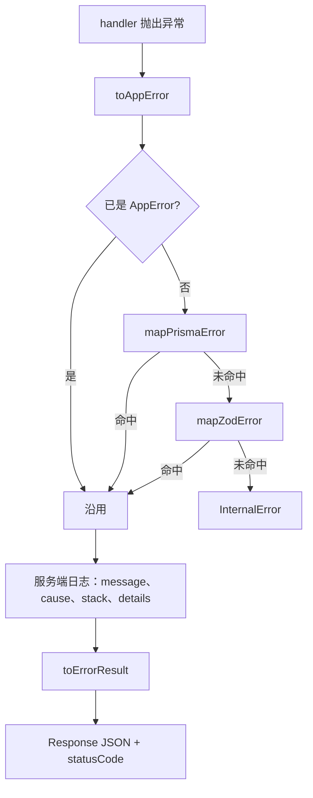

# 全局统一错误处理

本文约定 Route Handler 的错误模型、映射规则和对外响应。实现位于 `app/src/lib/utils/errors`。

后台接口返回可操作原因。堆栈、SQL 与原始输入只记服务端日志，不返回浏览器。

## 1. 两层模型

| 层 | 类型 | 用途 |
| ---- | ---- | ---- |
| 服务端 | `AppError` 及其子类 | `throw` / `catch`、打日志。可带 `module`、`cause`、`details`、`errorId` |
| 客户端 | `ClientError`，包在 `ErrorResult` 里 | HTTP JSON。只含 `code`、`message`，以及允许下发的 `details` / `errorId` |

成功体与失败体组成 `ApiResult<T>`：

```ts
{ ok: true, data: T, timestamp: string }
{ ok: false, error: { code, message, details?, errorId? } }
```

`apiHandler` 只接管失败分支。成功响应由具体 handler 自己返回。

## 2. 错误码与模块

| `ErrorCode` | HTTP | 子类 | 来源 |
| ---- | ---- | ---- | ---- |
| `BAD_REQUEST` | 400 | `BadRequestError` | Zod 校验、外键约束、非法 ORM 参数 |
| `UNAUTHORIZED` | 401 | `UnauthorizedError` | 业务抛出 |
| `FORBIDDEN` | 403 | `ForbiddenError` | 业务抛出 |
| `NOT_FOUND` | 404 | `NotFoundError` | 业务抛出 |
| `CONFLICT` | 409 | `ConflictError` | 唯一约束，或业务抛出 |
| `INTERNAL` | 500 | `InternalError` | 未分类的数据库、连接、ORM 与未知异常 |

`INTERNAL` 在构造时生成 `errorId`。其余错误码没有 `errorId`。

`SystemModule`：`route`、`taxonomy`、`content`、`syslog`、`media`、`auth`。调用方传入当前模块，映射函数不猜测来源。

查询未命中不会变成数据库异常。`.first()` 返回 `null` 时，由业务抛 `NotFoundError`。

## 3. 处理流程



入口：

```ts
export const POST = apiHandler("content", async (req) => {
  // 业务失败直接 throw NotFoundError / ConflictError / ...
  return Response.json({ ok: true, data, timestamp });
});
```

## 4. Prisma 8

分类依据是 `SqlQueryError.sqlState` 与 `isStructuredError`。

| 条件 | 结果 | 服务端 `details` |
| ---- | ---- | ---- |
| `isUniqueConstraintViolation`（`23505`） | `ConflictError("资源已存在")` | `constraint`、`table`、`column` |
| `sqlState === "23503"` | `BadRequestError("存在关联约束，无法完成操作")` | 同上 |
| 其它 `SqlQueryError` | `InternalError("数据库查询失败")` | 无 |
| `SqlConnectionError` | `InternalError("数据库连接失败")` | 无 |
| `ORM.ARGUMENT_*`、`ORM.COLUMN_UNKNOWN` | `BadRequestError`，消息用框架原文 | `meta` |
| 其它结构化错误 | `InternalError("ORM 运行时错误")` | `{ code, meta }`，仅日志 |

原始错误放在 `cause`。SQL 文本不进入响应。

## 5. Zod 4

`instanceof ZodError` 命中后映射为 `BadRequestError("校验失败")`。字段列表来自 `error.issues`，并展开 `invalid_union`、`invalid_key`、`invalid_element` 的嵌套 issue。

`details` 为 `{ path, message }[]`。`input` 留在 `cause`。

## 6. 对外响应

`apiHandler` 捕获后写 `console.error`，字段包括请求方法、URL、错误名、`code`、`module`、原始 `message`、`errorId`、`details`、`cause`、`stack`。

| `code` | `message` | `details` | `errorId` |
| ---- | ---- | ---- | ---- |
| 非 `INTERNAL` | 服务端原文 | 有则下发 | 无 |
| `INTERNAL` | 固定为「服务器内部错误」 | 不下发 | 下发 |

HTTP 状态使用 `AppError.statusCode`。

```json
{
  "ok": false,
  "error": {
    "code": "BAD_REQUEST",
    "message": "校验失败",
    "details": [{ "path": "path", "message": "路径不合法" }]
  }
}
```

```json
{
  "ok": false,
  "error": {
    "code": "INTERNAL",
    "message": "服务器内部错误",
    "errorId": "…"
  }
}
```

## 7. 文件

| 文件 | 职责 |
| ---- | ---- |
| `codes.ts` | `ErrorCode`、`SystemModule` |
| `app-error.ts` | `AppError` 与六个子类、HTTP 状态 |
| `api-result.ts` | `ApiResult`、`ClientError` |
| `map-zod-error.ts` | Zod 4 → `BadRequestError` |
| `map-prisma-error.ts` | Prisma 8 / SQL → `AppError` |
| `to-app-error.ts` | 未知异常收口为 `AppError` |
| `api-handler.ts` | Route Handler 的 catch、日志与响应 |
