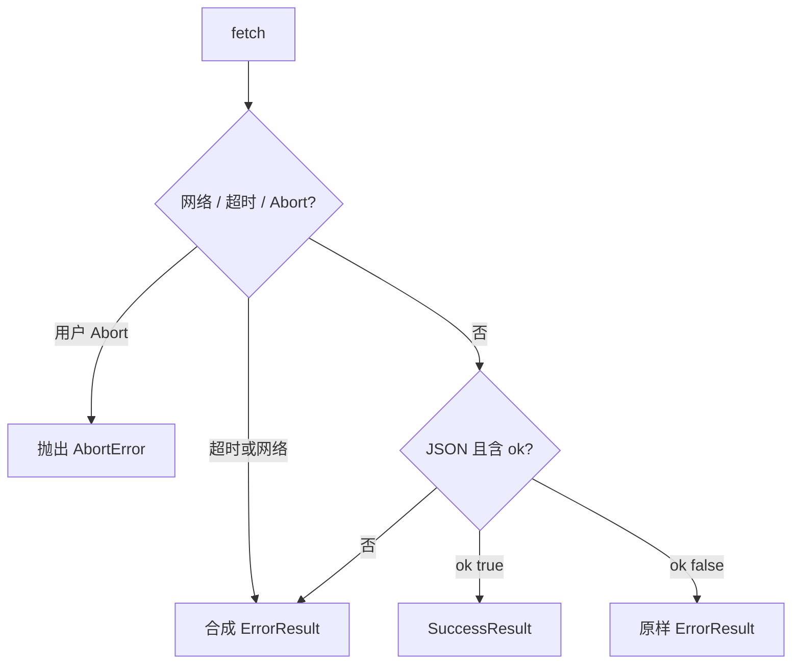
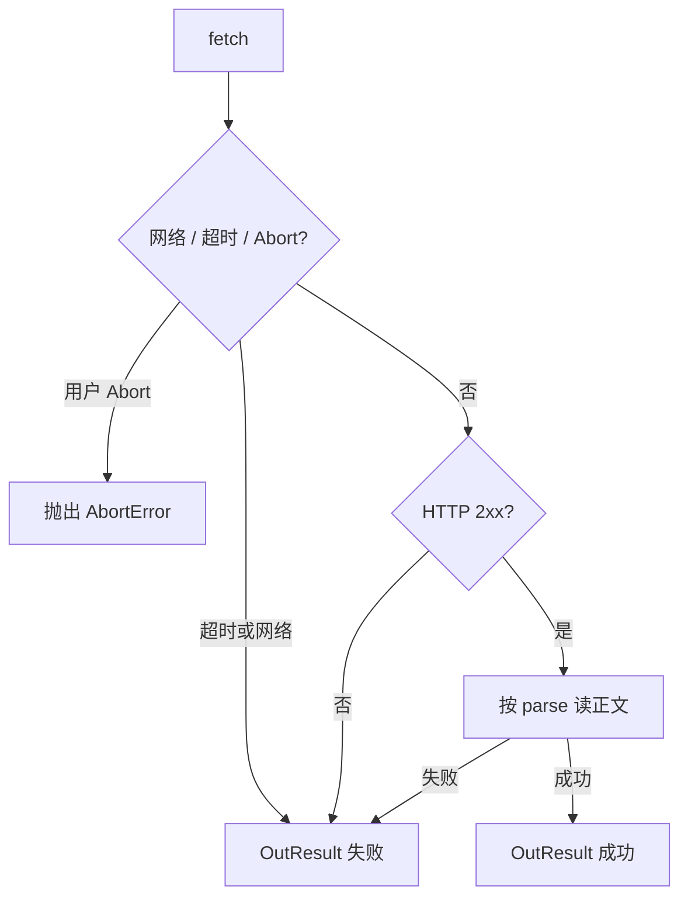

# Fetch 封装设计

后台 CSR 经 TanStack Query 调用 Route Handler。请求统一走 `Http`。站内响应收成 `ApiResult<T>`，错误体形状见 [全局统一错误处理](./excerption.md)。公开站点 SSR 不走这层。

实现位于 `app/src/lib/utils/http`。站内与外部走 `fetch`；带进度的上传走 `XMLHttpRequest`。不引入 `AppError`。

## 1. 职责

| 做 | 不做 |
| ---- | ---- |
| 补齐 JSON / 超时；站内带会话 Cookie | 重试、缓存、并发去重（交给 TanStack Query） |
| 站内响应收成 `ApiResult<T>` | 业务跳转、弹 toast |
| 网络断开、超时、非约定正文合成失败结果 | 解析 Prisma / Zod |
| 外部请求返回 `OutResult<T>`，不假定对方是 `ApiResult` | 在客户端校验权限 |
| 上传进度（仅 XHR） | 服务端上传 |

方法分三族：

| 族 | 方法 | 传输 | 返回 |
| ---- | ---- | ---- | ---- |
| 站内 | `get` / `post` / `put` / `patch` / `delete` | `fetch` | `ApiResult<T>` |
| 外部 | `getOut` / `postOut` / `putOut` / `patchOut` / `deleteOut` | `fetch` | `OutResult<T>` |
| 上传 | `upload` / `uploadOut` | `XMLHttpRequest` | 分别为 `ApiResult<T>` / `OutResult<T>` |

`unwrap` 只解包站内 `ApiResult`。外部另用 `unwrapOut`。

## 2. 返回约定

请求方法不抛业务错误。调用方用 `result.ok` 分支。

用户或路由取消（`AbortError`，且不是超时）原样抛出，不收成结果。

TanStack Query 需要 throw 时用解包函数：成功返回 `data`，失败 throw。

```ts
const result = await Http.post<Article>("/api/content/articles", body);
if (!result.ok) {
  // result.error.code / message / details / errorId
}

const article = await Http.unwrap(Http.get<Article>("/api/content/articles/1"));

const remote = await Http.getOut<UnknownPayload>("https://example.com/v1/x");
if (!remote.ok) {
  // remote.status? / remote.error
}
```

## 3. 站内请求

- `credentials: "same-origin"`，带上 Next-Auth 会话 Cookie。
- 默认 `Accept: application/json`。
- `body` 为普通对象时序列化为 JSON，并设 `Content-Type: application/json`。
- `body` 为 `FormData` 时不设 `Content-Type`，交给浏览器带 boundary。
- 默认超时 15s，与调用方传入的 `AbortSignal` 合并；任一中止即取消请求。
- 路径为站内相对路径（`/api/...`）。不在封装里拼环境域名。

查询参数用对象或 `URLSearchParams`，由封装拼到 URL 上。

## 4. 站内响应收口



| 情况 | `code` | `message` |
| ---- | ---- | ---- |
| 服务端已返回 `ErrorResult` | 沿用 | 沿用 |
| 超时 | `INTERNAL` | 请求超时 |
| 用户或路由取消（非超时） | 抛出 | — |
| 网络失败 | `INTERNAL` | 网络异常 |
| HTTP 有状态但正文不是 `ApiResult` | 按状态粗分，缺省 `INTERNAL` | 响应无法解析 |

状态粗分：`401` → `UNAUTHORIZED`，`403` → `FORBIDDEN`，`404` → `NOT_FOUND`，`409` → `CONFLICT`，`400`～`499` → `BAD_REQUEST`，其余 → `INTERNAL`。不把 HTML 错误页当成功。

`401` 不在 `Http` 内跳登录。由 Query / 布局根据 `error.code` 处理。

## 5. 外部请求（`*Out`）

外部 API 不是本系统的 `ApiResult`。`*Out` 只做传输与状态判断，不按 `ok` 字段解析对方正文。

- URL 允许绝对地址。
- 默认 `credentials: "omit"`，不带会话 Cookie。调用方可覆盖。
- `parse` 默认 `"json"`，可选 `"text"` | `"raw"`。
- 超时、`AbortSignal`、JSON / `FormData` 序列化与站内相同。



| 情况 | 结果 |
| ---- | ---- |
| 2xx 且按 `parse` 读成功 | `{ ok: true, status, data, headers }` |
| 非 2xx | `{ ok: false, status, error }`，`error.code` 按状态粗分 |
| 超时 / 网络失败 | `{ ok: false, error }`，`code` 为 `INTERNAL` |
| 用户 Abort（非超时） | 抛出 |

不要用站内方法打外部 URL。对方即使返回 JSON，也不当成本系统的 `ErrorResult`。

## 6. 上传进度

`fetch` 不提供可靠的上传进度。`upload` / `uploadOut` 使用 `XMLHttpRequest`，仅浏览器可用。

- `body` 为 `FormData` | `Blob` | `File`。`FormData` 不手动设 `Content-Type`。
- `xhr.upload.onprogress` 回调 `{ loaded, total, percent }`。`total === 0` 时 `percent` 为 `0`。
- `signal` 触发 `xhr.abort()`。超时与用户取消的区分与站内相同。
- `upload` 按站内 `ApiResult` 解析响应；`uploadOut` 按 `OutResult` 解析。

```ts
await Http.upload<MediaAsset>("/api/media", formData, {
  onProgress: ({ percent }) => setPercent(percent),
});

await Http.uploadOut<unknown>("https://example.com/upload", file, {
  onProgress: ({ loaded, total }) => {},
});
```

## 7. 与 Query 的边界

```ts
useQuery({
  queryKey: ["article", id],
  queryFn: () => Http.unwrap(Http.get<Article>(`/api/content/articles/${id}`)),
});
```

`queryFn` 只负责拿数据。重试、缓存、失效由 Query 配置。表单校验错误（`BAD_REQUEST` + `details`）通常 `retry: false`。

外部请求不要默认套进同一套 Query 约定；需要时用 `unwrapOut`。

## 8. 类型草图

```ts
type HttpOptions = {
  query?: Record<string, string | number | boolean | undefined>;
  headers?: HeadersInit;
  signal?: AbortSignal;
  timeoutMs?: number;
};

type OutOptions = HttpOptions & {
  credentials?: RequestCredentials;
  parse?: "json" | "text" | "raw";
};

type OutResult<T> =
  | { ok: true; status: number; data: T; headers: Headers }
  | { ok: false; status?: number; error: ClientError };

type UploadProgress = {
  loaded: number;
  total: number;
  percent: number;
};

type UploadOptions = HttpOptions & {
  onProgress?: (progress: UploadProgress) => void;
};

class Http {
  static get<T>(url: string, options?: HttpOptions): Promise<ApiResult<T>>;
  static post<T>(url: string, body?: unknown, options?: HttpOptions): Promise<ApiResult<T>>;
  static put<T>(url: string, body?: unknown, options?: HttpOptions): Promise<ApiResult<T>>;
  static patch<T>(url: string, body?: unknown, options?: HttpOptions): Promise<ApiResult<T>>;
  static delete<T>(url: string, options?: HttpOptions): Promise<ApiResult<T>>;

  static getOut<T>(url: string, options?: OutOptions): Promise<OutResult<T>>;
  static postOut<T>(url: string, body?: unknown, options?: OutOptions): Promise<OutResult<T>>;
  static putOut<T>(url: string, body?: unknown, options?: OutOptions): Promise<OutResult<T>>;
  static patchOut<T>(url: string, body?: unknown, options?: OutOptions): Promise<OutResult<T>>;
  static deleteOut<T>(url: string, options?: OutOptions): Promise<OutResult<T>>;

  static upload<T>(url: string, body: FormData | Blob | File, options?: UploadOptions): Promise<ApiResult<T>>;
  static uploadOut<T>(url: string, body: FormData | Blob | File, options?: UploadOptions & Pick<OutOptions, "credentials" | "parse">): Promise<OutResult<T>>;

  static unwrap<T>(result: Promise<ApiResult<T>>): Promise<T>;
  static unwrapOut<T>(result: Promise<OutResult<T>>): Promise<T>;
}
```

`unwrap` / `unwrapOut` 在 `ok: false` 时 throw 的对象应带 `name`（如 `ClientRequestError`）和 `ClientError` 字段，便于 Query 与表单读取 `details`。
