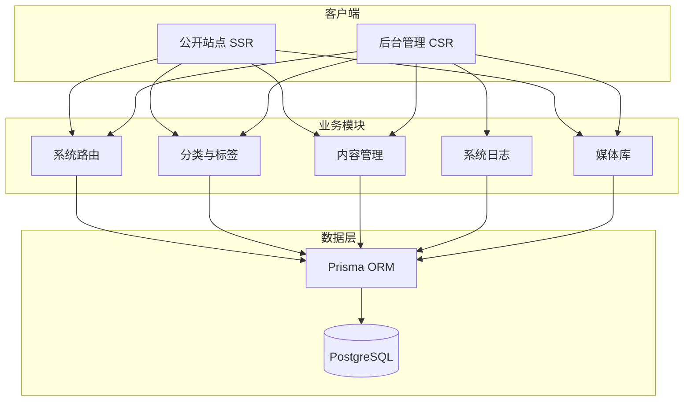
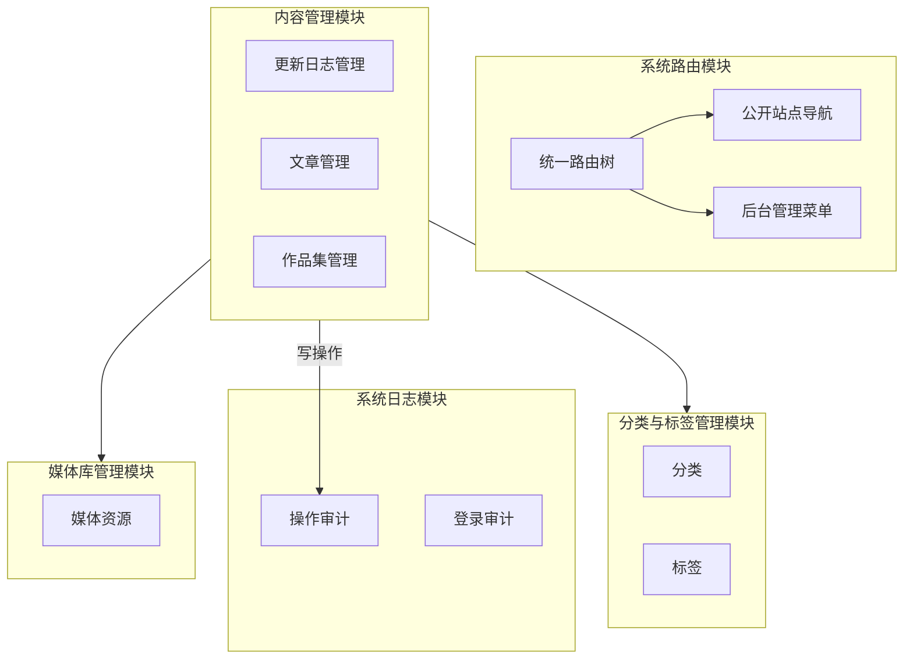
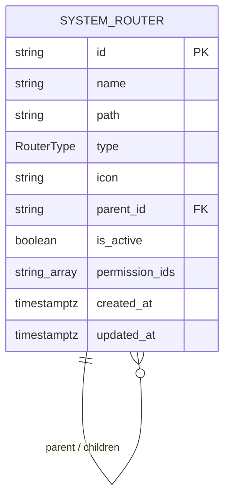

# 系统概要设计文档

## 目录

- [1. 引言](#1-引言)
  - [1.1 编写目的](#11-编写目的)
  - [1.2 项目背景](#12-项目背景)
- [2. 总体设计](#2-总体设计)
  - [2.1 设计原则](#21-设计原则)
  - [2.2 系统总体架构](#22-系统总体架构)
  - [2.3 技术选型](#23-技术选型)
- [3. 模块与功能结构设计](#3-模块与功能结构设计)
  - [3.1 模块结构划分](#31-模块结构划分)
  - [3.2 核心模块职责](#32-核心模块职责)
- [4. 接口与数据流设计](#4-接口与数据流设计)
  - [4.1 统一错误处理设计](#41-统一错误处理设计)
- [5. 数据模型与数据库](#5-数据模型与数据库)
  - [5.1 实体关系逻辑](#51-实体关系逻辑)
  - [5.2 核心数据表结构概要](#52-核心数据表结构概要)
- [6. 非功能设计](#6-非功能设计)
- [7. 命名约定](#7-命名约定)
- [参考资料](#参考资料)

## 1. 引言

### 1.1 编写目的

本文档用于明确个人内容管理系统（Personal CMS）的总体技术架构、核心模块划分、数据库设计及关键技术实现方案，为后续的详细设计与全栈编码提供指导。

### 1.2 项目背景

本系统是一款专门用于个人网站发布博客、文章和作品集（Portfolio）的轻量级内容管理系统，具备高灵活性的标签分类体系、内容多版本快照追踪的系统。

## 2. 总体设计

### 2.1 设计原则

- **前后端一体化与全栈渐进：** 基于 Next.js App Router 架构，混合使用服务端渲染（SSR）以利于 SEO，与客户端渲染（CSR）以保证后台交互体验。
- **数据强一致性：** 核心内容与版本快照的写操作必须包含在数据库事务中，确保数据不出错。
- **高内聚低耦合：** 系统路由、分类与标签、内容管理、系统日志、媒体库各自独立，通过关联关系协作。

### 2.2 系统总体架构

系统采用 Next.js 全栈架构：公开站点走 SSR，后台走 CSR；业务模块经 Prisma 写入 PostgreSQL。



### 2.3 技术选型

- **全栈框架：**  Next.js (App Router) + TypeScript
- **UI 与样式：** Tailwind CSS + Shadcn UI + react-textarea-autosize
- **状态管理与表格：** TanStack Table + TanStack Form
- **ORM 与数据库：** Prisma ORM + PostgreSQL
- **身份认证：** Next-Auth
- **测试工具：** Vitest


## 3. 模块与功能结构设计

### 3.1 模块结构划分

功能模块与 README 一致，共五块。系统路由用同一棵树同时维护公开站点导航和后台管理菜单；内容管理下分更新日志、文章、作品集，保存时在同一事务里写入正文和版本快照，并挂到分类、标签和媒体；系统日志记录登录和后台写操作。



### 3.2 核心模块职责

| 模块名称 | 子模块 | 职责描述 | 核心设计要点 |
| ---- | ---- | ---- | ---- |
| 系统路由 | — | 用同一棵路由树维护公开站点导航和后台管理菜单 | 自关联树。节点类型为 set、group、directory、page。后台节点使用 icon 与 permissionIds。删除父节点时限制级联 |
| 分类与标签管理 | — | 为更新日志、文章和作品集提供分类归属与多标签 | 分类与标签各自独立，通过关联挂到内容，同名项靠关联消歧 |
| 内容管理 | 更新日志管理 | 发布和维护站点更新记录 | 与文章、作品集共用保存事务：version 递增，正文与版本快照双表写入 |
| 内容管理 | 文章管理 | 创建和修改博客文章 | 保存时自动递增 version，正文与快照在同一事务中写入 |
| 内容管理 | 作品集管理 | 管理作品集页面 | 同样走版本快照，并可挂分类、标签和媒体 |
| 系统日志 | 操作审计 | 记录后台关键写操作 | 记录操作者、时间、对象和结果 |
| 系统日志 | 登录审计 | 记录登录与登出 | 身份校验使用 Next-Auth。记录账号、时间、是否成功 |
| 媒体库管理 | — | 管理图片等媒体资源，供内容引用 | 资源通过关联被内容引用，不把文件本体直接写入正文表 |

## 4. 接口与数据流设计

核心数据流见 [核心数据流](./core-data-flows.md)。

### 4.1 统一错误处理设计

定义外部系统接口、内部模块间通信协议及 API 规范。

## 5. 数据模型与数据库

### 5.1 实体关系逻辑



### 5.2 核心数据表结构概要

``` Prisma
// use prisma-8

// -------------------------- ENUM -------------------------------

// 路由类型枚举
enum RouterType {
  set // 集合
  group // 分组
  directory // 目录
  page // 页面
}

// -------------------------- MODEL --------------------------------

// =========================
// T1-系统路由表
// =========================
model SystemRouter {
  id             String               @id @default(uuid())
  name           String
  path           String?
  type           RouterType           @default(page)
  icon           String?
  parentId       String?              @map("parent_id")
  isActive       Boolean              @default(true) @map("is_active")
  permissionIds  String[]             @default([]) @map("permission_ids")
  createdAt      TimestamptzString    @default(now()) @map("created_at")
  updatedAt      temporal.updatedAtString()

  parent         SystemRouter?        @relation("SystemRouterTree", fields: [parentId], references: [id], onDelete: Restrict)
  children       SystemRouter[]       @relation("SystemRouterTree")

  @@unique([path, parentId])
  @@index([path])
  @@index([parentId])
  @@map("system_router")
}
```

## 6. 非功能设计

阐述系统的安全设计（权限、加密）、性能设计（并发、缓存、扩展性）与可用性指标。

## 7. 命名约定

## 参考资料